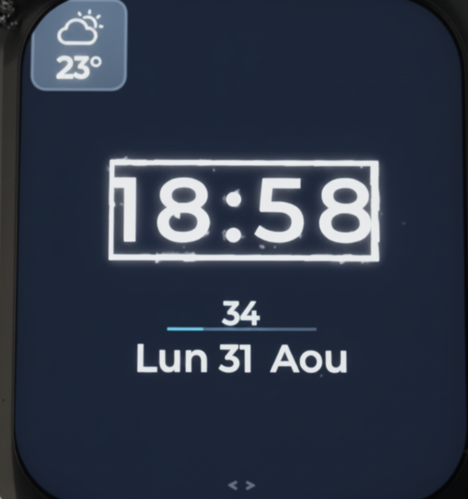
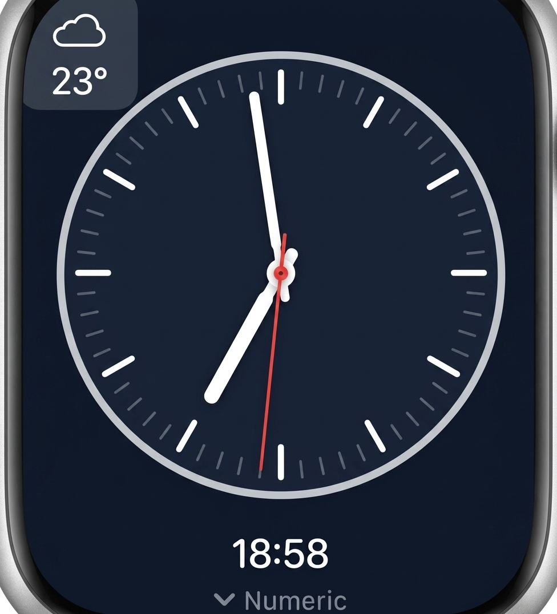
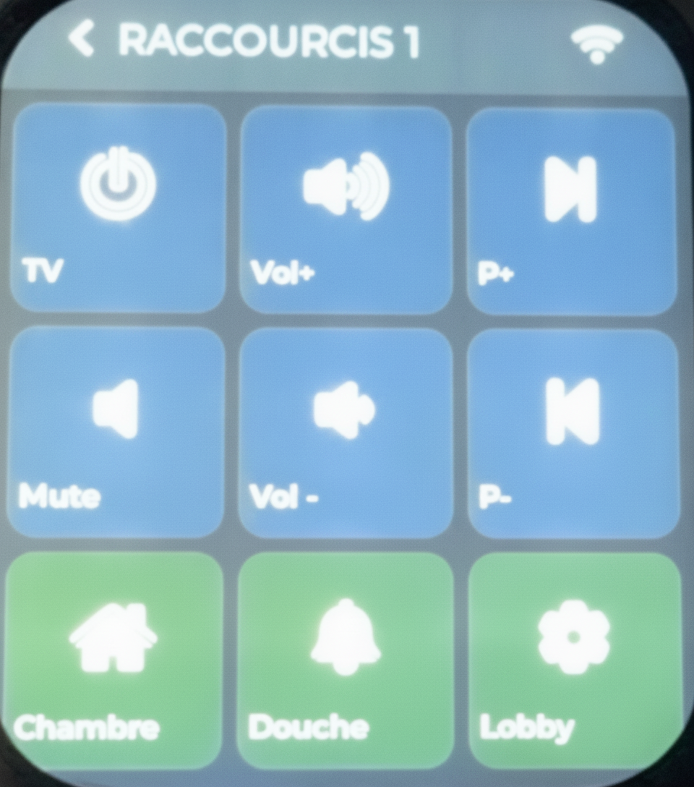
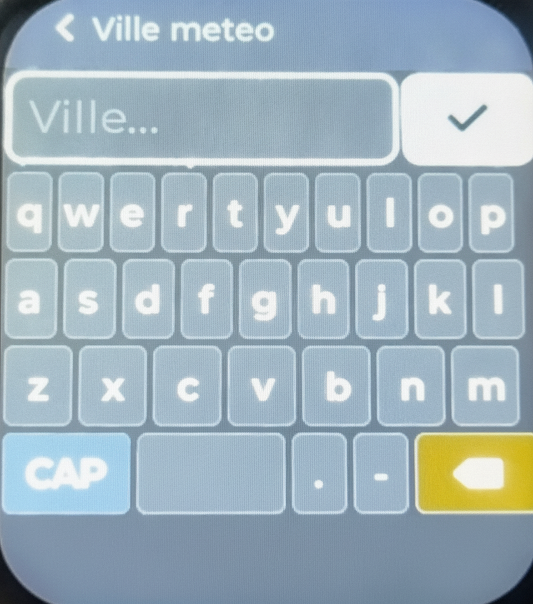
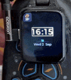

# DomoWatch

**A smart, connected clock for home automation — built on Waveshare ESP32-S3 1.69"**

DomoWatch transforms a compact touchscreen into a fully featured home control hub: real-time clock, live weather, and up to 18 one-tap HTTP shortcuts to trigger any home automation action — lights, scenes, appliances, alarms — directly from your wall.

<p align="center">
  
  
  
  
</p>

<p align="center">
  
</p>

---

## ✨ Features at a glance

### 🕐 Clock & Time
- Digital and analog clock faces, switchable with a swipe
- Automatic time synchronization via NTP (pool.ntp.org)
- Manual time setting with immediate application
- Automatic timezone detection from weather city selection (~300 IANA timezones)
- Date display with abbreviated day and month names

### 🌤️ Live Weather
- Current temperature and weather condition, updated every 30 minutes
- City selection with geocoding search (type any city name, pick from results)
- Automatic timezone switching when you change city
- Powered by [Open-Meteo](https://open-meteo.com/) — free, no API key required

### 🏠 HTTP Shortcuts — Home Automation Hub
- **18 configurable buttons** across 2 pages (9 buttons per page)
- Each button sends an HTTP POST request to any URL on your local network
- Fully configurable: label, icon, color, target URL
- Optional confirmation popup per button to prevent accidental triggers
- Instant feedback — response status logged, heap usage monitored
- **Perfect for Home Assistant, Jeedom, openHAB, Node-RED** or any HTTP-capable system

### 🌐 Web Configuration Interface
- Built-in web server for button configuration (no app required)
- Access from any browser on your local network: `http://<device-IP>/`
- Configure button labels, icons, colors and URLs visually
- Export and import configuration as JSON for backup or sharing
- Translated in the active language (French or English)

### 🔄 Over-The-Air Updates (OTA)
- Update firmware wirelessly, directly from the device
- Check for updates manually from the About popup
- Download progress bar with visual feedback
- Automatic rollback if new firmware fails to boot
- Updates served from GitHub — no additional infrastructure required

### 🌍 Multilingual Interface
- Full **French and English** support across all screens and web interface
- Switch language instantly with a single tap — no reboot required
- Language preference saved across reboots

### 💡 Brightness Control
- Adjustable backlight from 50% to 100%
- Smooth real-time preview while sliding
- Preference saved across reboots

### 📶 Robust WiFi Connectivity
- Multi-AP support: automatically picks the strongest access point when multiple share the same SSID
- Active link monitoring — detects silent WiFi drops that the driver reports as connected
- Automatic reconnection with exponential backoff
- Roaming between access points when signal drops below threshold

---

## 🏠 Home Automation with Webhooks

DomoWatch is designed to be a **physical control interface for your home automation system**. The HTTP shortcut system lets you trigger any action that your automation platform exposes over HTTP.

### How it works

Each button on DomoWatch sends an HTTP POST request to a URL you configure. Your home automation system listens for these requests and executes the corresponding action.

```
[DomoWatch button tap]
        │
        ▼
HTTP POST → http://your-server/webhook/your-token
        │
        ▼
[Home automation platform]
        │
        ▼
[Action: turn on lights, start scene, open blinds...]
```

### Integration with Home Assistant

Home Assistant supports **webhooks** natively. Each webhook generates a unique URL that triggers an automation when called.

**Step 1 — Create a webhook automation in Home Assistant:**

In Home Assistant, go to **Settings → Automations → Create Automation**, then:
- Trigger type: **Webhook**
- Home Assistant assigns a unique webhook ID (e.g. `my-living-room-lights`)
- The full URL will be: `http://your-ha-ip:8123/api/webhook/my-living-room-lights`

**Step 2 — Configure a DomoWatch button:**

Open the DomoWatch web interface (`http://<device-IP>/`), then for any button:
- **Label**: `Living Room` (displayed on screen, max 20 chars)
- **Icon**: choose from 35 built-in icons (POWER, HOME, LIGHT, etc.)
- **Color**: pick any color for the button background
- **URL**: `http://192.168.1.x:8123/api/webhook/my-living-room-lights`

**Step 3 — Tap and go:**

Tap the button on DomoWatch → Home Assistant receives the webhook → your automation runs.

### Integration with other platforms

| Platform | Protocol | Example URL format |
|---|---|---|
| Home Assistant | Webhook | `http://ha-ip:8123/api/webhook/token` |
| Jeedom | API | `http://jeedom-ip/core/api/jeeApi.php?apikey=KEY&type=cmd&id=ID` |
| openHAB | REST API | `http://openhab-ip:8080/rest/items/ItemName` |
| Node-RED | HTTP In | `http://node-red-ip:1880/your-endpoint` |
| Any HTTP server | Custom | Any URL that accepts POST requests |

### Example automations

- **Good morning** — starts a wake-up scene (gradual lights, music, coffee maker)
- **All off** — turns off all lights and appliances before leaving
- **Movie mode** — dims lights, closes blinds, turns on TV
- **Alarm arm/disarm** — toggles your home security system
- **Guest mode** — activates specific lighting and temperature settings
- **Ring doorbell** — triggers a notification on all phones

---

## 📱 Navigation

DomoWatch uses **swipe gestures** to navigate between screens:

```
[Analog Clock] ↕
[Digital Clock] ↔ [Shortcuts Page 1] ↔ [Config 1: WiFi / Weather / Language]
                         ↕                          ↕
               [Shortcuts Page 2]         [Config 2: Manual Time]
                                                    ↕
                                          [Config 3: Web Mode / Brightness]
```

- **Swipe left/right** to move horizontally between screens
- **Swipe up/down** to move vertically between screens
- **Tap** to activate buttons, toggle settings, confirm actions

---

## 🔧 Hardware

| Component | Specification |
|---|---|
| Board | Waveshare ESP32-S3-Touch-LCD-1.69 |
| Display | ST7789, 240×280 px, 1.69" |
| Touch | CST816T capacitive, I2C |
| SoC | ESP32-S3, dual-core 240MHz |
| Flash | 16 MB |
| PSRAM | 8 MB OPI |
| Connectivity | WiFi 802.11 b/g/n, Bluetooth 5 |

---

## 🚀 Getting Started

→ **[Getting Started Guide](docs/getting-started.md)** — choose your path (ready-to-use device or DIY build)

→ **[User Guide](docs/user-guide.md)** — complete guide to all features

→ **[DIY Installation](docs/diy-install.md)** — hardware setup and firmware flashing

---

## 📋 Requirements

- Waveshare ESP32-S3-Touch-LCD-1.69 board (or compatible pre-assembled DomoWatch device)
- WiFi network (2.4 GHz, WPA2)
- A home automation platform with HTTP webhook support (optional but recommended)
- A browser-equipped device on the same network for configuration

---

## 📄 License

Copyright © 2026 Franck Sachet. All rights reserved.

This software is provided for **personal, non-commercial use only**.
See [LICENSE](LICENSE) for full terms.

---

## 📦 Releases

See [CHANGELOG.md](CHANGELOG.md) for version history and release notes.

Current version: **1.0.1**
