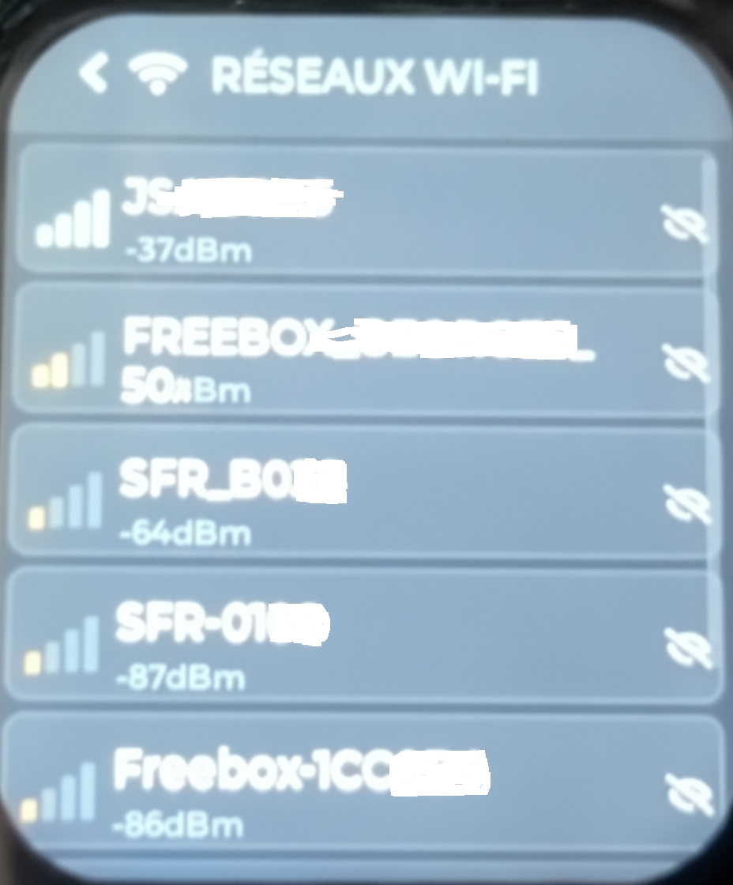
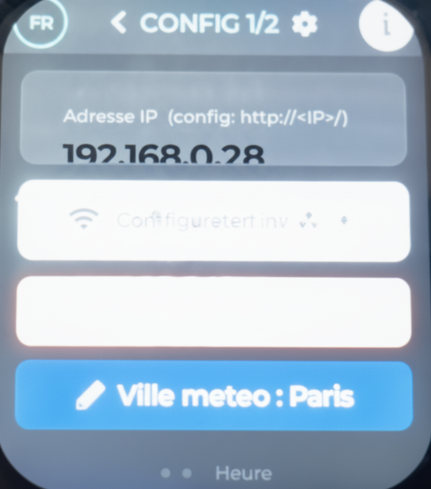
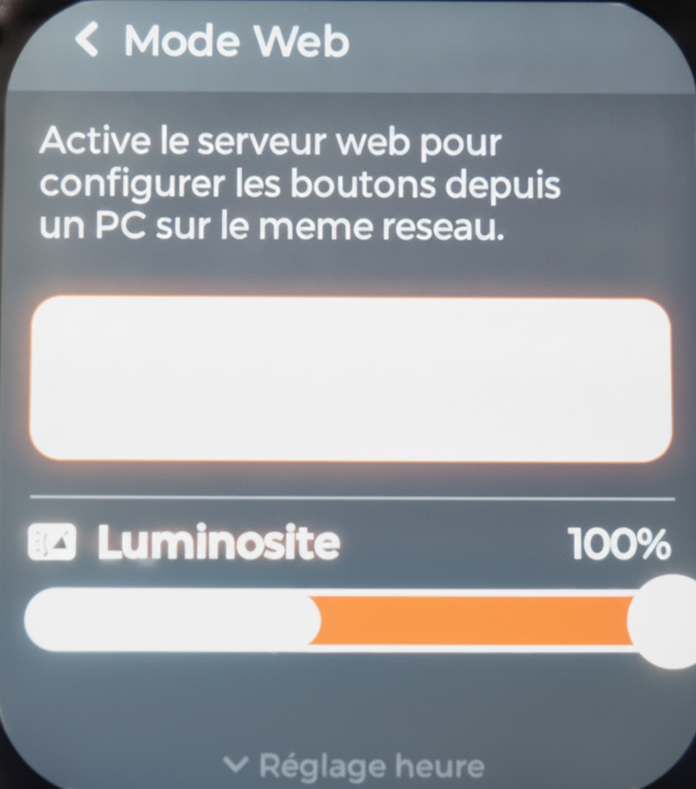
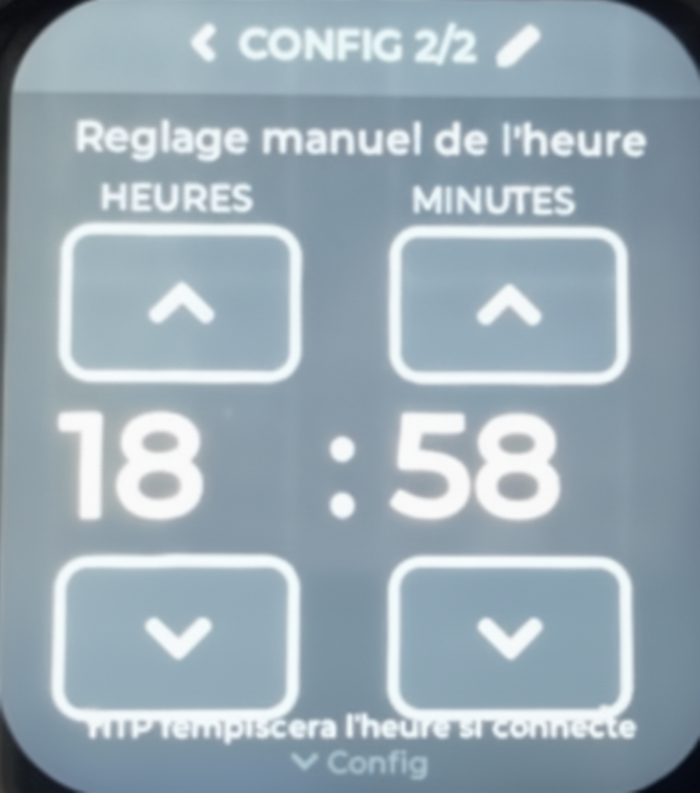

# User Guide

Complete guide to all DomoWatch features.

---

## Table of Contents

1. [First-time setup](#1-first-time-setup)
2. [Navigation](#2-navigation)
3. [Clock screens](#3-clock-screens)
4. [Weather](#4-weather)
5. [HTTP Shortcuts](#5-http-shortcuts)
6. [Configuring buttons (web interface)](#6-configuring-buttons-web-interface)
7. [Settings — Config 1](#7-settings--config-1)
8. [Settings — Config 2: Manual time](#8-settings--config-2-manual-time)
9. [Settings — Config 3: Web mode & brightness](#9-settings--config-3-web-mode--brightness)
10. [Language](#10-language)
11. [Firmware updates (OTA)](#11-firmware-updates-ota)

---

## 1. First-time setup

On first boot, DomoWatch displays the digital clock with a "Not synced" indicator — this is normal until WiFi is connected.

### Connect to WiFi



1. Swipe **right** from the clock screen to reach the shortcut pages
2. Swipe **right** again to reach **Config 1**
3. Tap **Configure Wi-Fi**
4. DomoWatch scans for networks — your network should appear in the list
5. Tap your network name



6. Enter your WiFi password using the on-screen keyboard
7. Tap **Connect**

Once connected, DomoWatch synchronizes the time automatically and fetches the weather for the default city (Paris). The "Not synced" indicator disappears.

> **WiFi is remembered across reboots** — you only need to do this once.

---

## 2. Navigation

DomoWatch uses swipe gestures on the touchscreen.

### Screen map

```
[Analog Clock]
      ↕ swipe up/down
[Digital Clock] ↔ [Shortcuts 1] ↔ [Config 1]
                          ↕                 ↕
                   [Shortcuts 2]     [Config 2]
                                           ↕
                                     [Config 3]
```

| Gesture | Action |
|---|---|
| Swipe left | Move right on the screen map |
| Swipe right | Move left (go back) |
| Swipe up | Move down on the screen map |
| Swipe down | Move up (go back) |
| Tap | Activate button / toggle / confirm |

---

## 3. Clock screens


### Digital clock
Displays hours, minutes, seconds, and the current date (day, date, month).
The seconds display uses the accent color (cyan).


### Analog clock
A traditional clock face. Tap anywhere on the clock face to toggle the backlight on/off.

**Switch between digital and analog:** swipe up from the digital clock to reach the analog face, swipe down to return.

---

## 4. Weather

The weather widget appears on both clock faces, showing:
- **Weather icon** (sun, clouds, rain, snow, storm, etc.)
- **Current temperature** in °C

Weather data is refreshed every **30 minutes** automatically.

### Change city


1. Go to **Config 1** (swipe right twice from the clock)
2. Tap **Weather city**
3. Type the name of any city (at least 3 characters)
4. Tap the search icon or wait — results appear below
5. Tap a result to select it

DomoWatch will:
- Update the weather immediately
- Automatically apply the correct timezone for the selected city

> Weather is powered by [Open-Meteo](https://open-meteo.com/) — free, no account needed.

---

## 5. HTTP Shortcuts


DomoWatch has **18 configurable buttons** across 2 shortcut pages (9 per page).

### Using a shortcut button

Simply **tap** the button. DomoWatch sends an HTTP POST request to the configured URL.

- If the button has a **confirmation** option enabled, a popup will ask "Confirm: [label]?" before sending
- Tap **YES** to confirm, **NO** to cancel

### What happens when you tap

```
Tap button → HTTP POST sent → Response received
```

The device waits for the server to respond (up to 3 seconds). If the server responds with HTTP 200, the action was successful. If you tap a button while another request is already in progress, it is queued and sent immediately after.

---

## 6. Configuring buttons (web interface)



Buttons are configured via the built-in web interface — no app required.

### Open the web interface

1. Make sure DomoWatch is connected to WiFi
2. Go to **Config 3** (swipe right twice, then swipe up twice from Config 1)
3. Toggle **Web Mode** — the display shows the device's IP address
4. On any device on the same network, open a browser and navigate to `http://<IP>/`
   (example: `http://192.168.1.42/`)

### Configure a button

The web interface shows all 18 buttons across 2 pages (use the Page 1 / Page 2 tabs).

For each button, you can set:

| Field | Description |
|---|---|
| **Icon** | Choose from 35 built-in icons (HOME, POWER, BELL, WIFI, etc.) |
| **Label** | Short name displayed on the button (max 20 characters) |
| **URL** | The HTTP endpoint to call (must be accessible from your local network) |
| **Color** | Button background color (color picker) |
| **Ask for confirmation** | If checked, a popup appears before sending the request |

### Save and close

1. Click **Save** to apply all changes — DomoWatch updates immediately
2. Go back to **Config 3** and toggle **Web Mode** off

> **Tip:** Use **Export JSON** to save your button configuration as a backup file.
> Use **Import** to restore it later or transfer to another DomoWatch device.

---

## 7. Settings — Config 1

Access: swipe right twice from the clock screen.

| Element | Description |
|---|---|
| **FR / EN button** (top left) | Switch interface language |
| **IP address** | Shows current IP when connected, "Not connected" otherwise |
| **Connect / Disconnect** | Toggle WiFi on/off |
| **Configure Wi-Fi** | Open WiFi network scanner |
| **Weather city** | Open city search screen |
| **ⓘ (About)** | Show version info and access firmware update |

---

## 8. Settings — Config 2: Manual time



Access: from Config 1, swipe up.

If your time is incorrect or NTP is unavailable, you can set it manually:

- Tap the **up/down arrows** next to Hours or Minutes
- Each tap applies the new time immediately to the system clock
- NTP will override this if the device connects to WiFi and synchronizes

---

## 9. Settings — Config 3: Web mode & brightness

Access: from Config 2, swipe up.

### Web Mode
Toggle the built-in web server on or off.
- When **active**: shows the device's IP address — open it in a browser to configure buttons
- When **inactive**: web server is stopped, saving resources

### Brightness
Use the slider to adjust backlight brightness between 50% and 100%.
The adjustment is applied in real time and saved automatically.

---

## 10. Language

DomoWatch supports **French** and **English**.

To switch language:
1. Go to **Config 1**
2. Tap the **FR** or **EN** button in the top-left corner
3. All screens switch instantly — no reboot needed

The language preference is saved across reboots.

---

## 11. Firmware updates (OTA)

DomoWatch can update its firmware wirelessly, directly from GitHub.

### Check for updates

1. Go to **Config 1**
2. Tap the **ⓘ** button (About)
3. In the popup, tap **Update** (or **Mise à jour** in French)
4. The OTA screen opens and automatically checks for a new version

### Install an update

If a new version is available:
1. The screen shows the available version and release notes
2. Tap **Install**
3. A progress bar shows the download progress (the file is ~1.6 MB)
4. DomoWatch reboots automatically after a successful download
5. The new firmware runs from a separate partition — if it fails to boot,
   the device automatically reverts to the previous version within 30 seconds

> **Do not unplug the device during installation.**

### After update

The device reboots with the new firmware. Your WiFi credentials, button configuration,
weather city, language and brightness settings are all preserved.

---

## Tips & Troubleshooting

**Clock shows "Not synced"**
→ Connect to WiFi. The clock synchronizes automatically within a few seconds.

**Weather shows old data**
→ Weather refreshes every 30 minutes. If WiFi was disconnected, it will update once reconnected.

**Button tap has no effect**
→ Check that your home automation server is running and reachable from the same network.
→ Open the web interface and verify the URL is correct.

**Web interface not accessible**
→ Make sure Web Mode is enabled (Config 3).
→ Make sure you are on the same WiFi network as DomoWatch.
→ Use the IP address shown on the Config 3 screen.

**WiFi keeps reconnecting**
→ This may happen if the router has an unusual configuration.
→ Try moving the device closer to the router during initial setup.

**OTA update fails**
→ Make sure WiFi is connected and stable.
→ Try again — temporary network issues are common.
→ If it persists, the firmware can always be re-flashed manually via USB (see [DIY Install](diy-install.md)).
